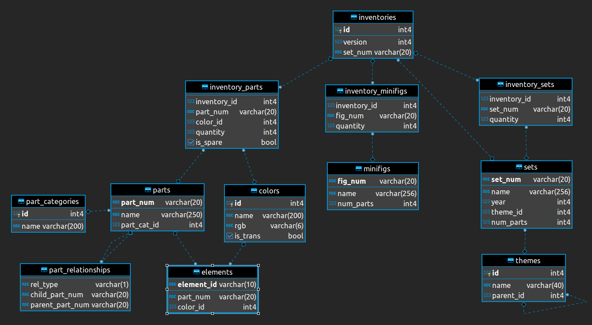

```{r setup, include=FALSE}
knitr::opts_chunk$set(echo = TRUE, warning=FALSE, message=FALSE, echo = FALSE)
```

# Streszczenie

Celem sprawozdania jest analiza bazy danych Lego na przestrzeni lat. Wykorzystano w tym celu bazę danych ze strony [Brickable](https://rebrickable.com/). Podczas analizy przejrzano większość atrybutów i ich cechy np. rozkłady danych. Wykazano również dwie korelacje między:

- ilością różnych klocków i kolorów w zestawach
- ilością części Lego i ilością figurek w zestawach

Zbadano tendencję wzrostową ilości zestawów na przestrzeni lat 1949 - 2023. Na samym końcu zbudowano model prognozowania ilości zestawów na rok, który także potwierdza to że ilość zestawów z każdym rokiem będzie rosnąć.

# Biblioteki

W celu dokonanie analizy bazy danych Lego za pomocą języka R, potrzebne były następujące biblioteki udostępniające szereg pożytycznych funkcji:

```{r wczytanie-bibliotek, echo=TRUE}
library(knitr)    #do stworzenia raportu
library(dplyr)    #do przetwarzania danych 
library(ggplot2)  #do rysowania wykresów
library(plotly)   #do rysowania interaktywnych wykresów
library(forecast) #do prognozowania szeregów czasowych
```

# Surowe dane

W sekcji opisane są działania wykonywane na surowych danych takie jak wczytywanie danych oraz prezentacja przykładowych obserwacji.

## Wczytywanie danych

Wczytanie danych dokonuje się w następujący sposób:

```{r wczytanie-danych, echo=TRUE}
setwd("dane")
colors <- read.csv("colors.csv")
elements <- read.csv("elements.csv")
inventories <- read.csv("inventories.csv")
inventory_minifigs <- read.csv("inventory_minifigs.csv")
inventory_parts <- read.csv("inventory_parts.csv")
inventory_sets <- read.csv("inventory_sets.csv")
minifigs <- read.csv("minifigs.csv")
part_categories <- read.csv("part_categories.csv")
part_relationship <- read.csv("part_relationships.csv")
parts <- read.csv("parts.csv")
sets <- read.csv("sets.csv")
themes <- read.csv("themes.csv")
```

## Schemat bazy danych

Schemat bazy danych prezentuje się następująco:

```{r schemat-bazy-danych, echo=FALSE}

```

W celu analizy danych ważne jest zrozumienie powyższego schematu. Jest on raczej dosyć prosty, poza jednym elementem jakim jest tabela *inventories*, która umożliwia wprowadzenia wielu wersji tego samego zestawu *sets*. Wersje są przydatne, jeżeli np. zmieniły się części w danym zestawie.

## Podgląd danych {.tabset .tabset-fade}

Tabele prezentujące 15 pierwszych obserwacji z każdej tabeli:

### colors {-}

```{r}
knitr::kable(head(colors,15))
```

### elements{-}

```{r}
knitr::kable(head(elements,15))
```

### inventories {-}

```{r}
knitr::kable(head(inventories,15))
```

### inventory_minifigs {-}

```{r}
knitr::kable(head(inventory_minifigs,15))
```

### inventory_parts {-}

```{r}
knitr::kable(head(inventory_parts,15))
```

### inventory_sets {-}

```{r}
knitr::kable(head(inventory_sets,15))
```

### minifigs {-}

```{r}
knitr::kable(head(minifigs,15))
```

### part_categories {-}

```{r}
knitr::kable(head(part_categories,15))
```

### part_relationship {-}

```{r}
knitr::kable(head(part_relationship,15))
```

### parts {-}

```{r}
knitr::kable(head(parts,15))
```

### sets {-}

```{r}
knitr::kable(head(sets,15))
```

### themes {-}

```{r}
knitr::kable(head(themes,15))
```

# Czyszczenie zbioru danych 

Ważnym elementem przed dokonaniem analizy danych jest przetworzenie brakujących danych. Nie zawsze powinno się takie dane usuwać. Wczytane dane reprezentują relacyjny schemat bazy danych, w których relacje między tabelami są prezentowane przez dodatkowe atrybuty - klucze obce. Wartość pusta w takim atrybucie może oznaczać brak relacji z inną tabelą - w takim przypadku nie powinno się usuwać takiej krotki.

Teraz nastąpi przejrzenie kolejnych zmiennych, zliczenie wartości pustych dla każdej kolumny i podjęcie decyzji co powinno się zrobić w przypadku wartości brakującej czyt. *NA*.

## Kolumny z wartością pustą {.tabset .tabset-fade}

### colors {-}

```{r}
knitr::kable(colors %>% summarise_all(funs(sum(is.na(.)))))
```

### elements {-}

```{r}
knitr::kable(elements %>% summarise_all(funs(sum(is.na(.)))))
```

### inventories {-}

```{r}
knitr::kable(inventories %>% summarise_all(funs(sum(is.na(.)))))
```

### inventory_minifigs {-}

```{r}
knitr::kable(inventory_minifigs %>% summarise_all(funs(sum(is.na(.)))))
```

### inventory_parts {-}

```{r}
knitr::kable(inventory_parts %>% summarise_all(funs(sum(is.na(.)))))
```

### inventory_sets {-}

```{r}
knitr::kable(inventory_sets %>% summarise_all(funs(sum(is.na(.)))))
```

### minifigs {-}

```{r}
knitr::kable(minifigs %>% summarise_all(funs(sum(is.na(.)))))
```

### part_categories {-}

```{r}
knitr::kable(part_categories %>% summarise_all(funs(sum(is.na(.)))))
```

### part_relationship {-}

```{r}
knitr::kable(part_relationship %>% summarise_all(funs(sum(is.na(.)))))
```

### parts {-}

```{r}
knitr::kable(parts %>% summarise_all(funs(sum(is.na(.)))))
```

### sets {-}

```{r}
knitr::kable(sets %>% summarise_all(funs(sum(is.na(.)))))
```

### themes {-}

```{r}
knitr::kable(themes %>% summarise_all(funs(sum(is.na(.)))))
```

## Przetwarzanie wartości pustych

Wartości puste występują tylko w atrybutach:

- *design_id* relacji *elements* - na potrzeby analizy nie jest potrzebna - nastąpi usunięcie tej kolumny
- *parent_id* relacji *themes* - jest kluczem obcym, wartość *NA* będzie traktowana jako brak relacji

```{r, echo=TRUE}
#usunięcie kolumny
elements <- elements[,-4]
```

# Analiza danych

W sekcji tej dokonana zostanie już właściwa analiza danych. Pokazane zostaną podstawowe statystyki i wykresy wielu atrybutów. Następnie badana będzie korelacja między atrybutami. Na końcu zostanie wykazana próba wyznaczenia pewnych trendów w rozwoju Lego a także przewidywania różnych cech zestawów Lego.

## Rozmiar zbioru

Na poniższym wykresie przedstawione zostały liczności każdego ze zbiorów danych.

```{r}
data = list(
  "colors" = colors,
  "elements" = elements,
  "inventories" = inventories,
  "inventory_minifigs" = inventory_minifigs,
  "inventory_parts" = inventory_parts,
  "inventory_sets" = inventory_sets,
  "minifigs" = minifigs,
  "part_categories" = part_categories,
  "part_relationship" = part_relationship,
  "parts" = parts,
  "sets" = sets,
  "themes"= themes
)

tabela <- names(data)
liczba_wierszy <- sapply(data, nrow)
xy <- data.frame(tabela, liczba_wierszy)

g <- ggplot(xy,aes(x=reorder(tabela,-liczba_wierszy),y=liczba_wierszy)) + 
  geom_bar(stat = "identity", position = "identity", fill="blue") +
  xlab("Tabela") +
  ylab("Liczba wierszy") +
  theme(axis.text.x = element_text(angle = 90, vjust = 0.5, hjust=1)) +
  geom_text(aes(label=liczba_wierszy), position=position_dodge(width=0.9), hjust = -0.5)

ggplotly(g)
```

```{r}
xy_sorted <- xy %>% arrange(desc(liczba_wierszy))
knitr::kable(xy_sorted, row.names=FALSE)
```

Jak widać, najbardziej liczną tabelą jest *inventory_parts*, a najmniej *part_categories*. Dodatkowe dane dotyczące liczby wierszy:

```{r}
knitr::kable(summary(xy_sorted)[,2], col.names = NULL)
```


## Podstawowe statystyki {.tabset .tabset-fade}

Podstawowe statyki/podsumowanie dla każdej tabeli:

### colors {-}

```{r}
options(knitr.kable.NA = '')

colors$is_trans <- as.factor(colors$is_trans)

knitr::kable(summary(colors))
knitr::kable(str(colors))
```

### elements {-}

```{r}
knitr::kable(summary(elements))
knitr::kable(str(elements))
```

### inventories {-}

```{r}
knitr::kable(summary(inventories))
knitr::kable(str(inventories))
```

### inventory_minifigs {-}

```{r}
knitr::kable(summary(inventory_minifigs))
knitr::kable(str(inventory_minifigs))
```

### inventory_parts {-}

```{r}
inventory_parts$is_spare <- as.factor(inventory_parts$is_spare)

knitr::kable(summary(inventory_parts))
knitr::kable(str(inventory_parts))
```

### inventory_sets {-}

```{r}
knitr::kable(summary(inventory_sets))
knitr::kable(str(inventory_sets))
```

### minifigs {-}

```{r}
knitr::kable(summary(minifigs))
knitr::kable(str(minifigs))
```

### part_categories {-}

```{r}
knitr::kable(summary(part_categories))
knitr::kable(str(part_categories))
```

### part_relationship {-}

```{r}
knitr::kable(summary(part_relationship))
knitr::kable(str(part_relationship))
```

### parts {-}

```{r}
knitr::kable(summary(parts))
knitr::kable(str(parts))
```

### sets {-}

```{r}
knitr::kable(summary(sets))
knitr::kable(str(sets))
```

### themes {-}

```{r}
knitr::kable(summary(themes))
knitr::kable(str(themes))
```

## Wartości atrybutów

Ponieważ większość atrybutów nie jest liczbowa, więc trudno było pokazać podsumowanie danych atrybutów za pomocą podstawowych narzędzi. Dodatkowo rozkład różnych atrybutów może się różnić w zależności w jaki sposób połączy się tabele. Przykładowo rozkład koloru można pokazać w kontekście pojedyńczych klocków Lego *parts* lub zapasów częsci Lego *inventory_parts*. W tej podsekcji przedstawione zostaną bardziej szczegółowe statystyki dotyczące wybranych (wg. mnie wartych rozważanie) atrybutów np. poprzez reprezentację rozkładów wartości.

### Rozkład koloru

Kolory wykorzystywane są w pojedyńczych klockach Lego:


```{r}
elements_with_colors <- inner_join(colors, elements, by=c("id" = "color_id"), na_matches = "never")
elements_with_colors_for_plot <- elements_with_colors %>%
                                  group_by(name) %>%
                                  summarize(n = n()) %>%
                                  filter(n > 1000)
p <- ggplot(elements_with_colors_for_plot, aes(x=reorder(name, n), y=n)) + 
  geom_bar(stat="identity",position = "identity", fill="red") + 
  coord_flip() +
  ylab("Ilość wystąpień") +
  xlab("Kolor")

ggplotly(p)
```
Najpopularniejszym kolorem jest czarny, potem biały i czerwony dostępnych klocków Lego.

### Rozkład kategorii zestawu

```{r}
sets_with_themes <- inner_join(themes, sets, by=c("id" = "theme_id"), na_matches = "never")
sets_with_themes_for_plot <- sets_with_themes %>%
                    group_by(name.x) %>%
                    summarize(n = n()) %>%
                    filter(n > 200)

p <- ggplot(sets_with_themes_for_plot, aes(x=reorder(name.x, n), y=n)) + 
  geom_bar(stat="identity",position = "identity", fill="red") + 
  coord_flip() +
  ylab("Ilość wystąpień") +
  xlab("Kategoria zestawu")

ggplotly(p)
```

Najczęściej występującym motywem wśród zestawów są: *Books*, *Star Wars* i *Technic*.

### Rozkład kategorii części Lego

```{r}
parts_with_categories <- inner_join(part_categories, parts, by=c("id" = "part_cat_id"), na_matches = "never")
parts_with_categories_for_plot <- parts_with_categories %>%
                    group_by(name.x) %>%
                    summarize(n = n()) %>%
                    filter(n>400)

p <- ggplot(parts_with_categories_for_plot, aes(x=reorder(name.x, n), y=n)) + 
  geom_bar(stat="identity",position = "identity", fill="red") + 
  coord_flip() +
  ylab("Ilość wystąpień") +
  xlab("Kategoria części Lego")

ggplotly(p)
```

Co ciekawe, najwięcej dostępnych części Lego jest z rodzaju *górnej części ciała*.

### Ilość zestawów na dany rok

```{r}
years_for_plot <- sets %>%
                  group_by(year) %>%
                  summarize(n = n())

p <- ggplot(years_for_plot, aes(x=year, y=n)) + 
  geom_bar(stat="identity",position = "identity", fill="red") + 
  ylab("Ilość zestawów") +
  xlab("Rok")

ggplotly(p)
```

Na podstawie tego wykresu, można dojść do wniosku że klocki Lego są coraz bardziej popularniejszy. Z każdym rokiem wychodzi coraz więcej zestawów Lego.

### Najpopularniejsze motywy na każdy rok

```{r}
sets_themes_year_fot_plot <- sets_with_themes %>%
                    group_by(year, name.x) %>%
                    summarize(n = n()) %>%
                    group_by(year) %>%
                    top_n(1, n) 

p <- ggplot(sets_themes_year_fot_plot, aes(x=year, y=n, color=name.x)) + 
  geom_point() + xlab("Rok") + ylab("Ilość zestawów") +scale_color_discrete(name="") 

ggplotly(p)
```


### Ilość wersji zestawów

```{r}
versions_for_table <- inventories %>%
                  group_by(version) %>%
                  summarize(n = n())

knitr::kable(versions_for_table, col.names = c("Wersja", "Ilość wystąpień"))
```

Jak widać, rzadko zdarzają się poprawki do stworzonych już zestawów Lego. Około 3% zestawów Lego ma drugą wersje

## Korelacje

W sekcji tej badane są dwie korelacja. Jedna między ilością różnych elementów i ilością różnych kolorów w zestawach Lego (biorąc pod uwagę że są różne wersje zestawów),
a druga między ilością części lego a ilością figurek w zestawie.

### Ilość różnych części i kolorów

```{r}
data_correlation <- elements %>%
  inner_join(parts, by = c("part_num" = "part_num")) %>%
  mutate(element_color = color_id) %>%
  select(part_num, element_id, element_color) %>%
  inner_join(inventory_parts, by = c("part_num" = "part_num")) %>%
  select(part_num, element_id, inventory_id, element_color) %>%
  group_by(inventory_id) %>%
  summarise(no_colors = n_distinct(element_color), no_elements = n_distinct(element_id))
```

Poniższy wykres pokazuje relację między ilością klocków a ilością kolorów w zestawach Lego. Wykres obejmuje 500 losowo wybranych punktów.

```{r}
examples <- data_correlation[sample(nrow(data_correlation), 500),]
p <- ggplot(examples, aes(x=no_colors, y=no_elements)) + geom_point(color="red", size=0.5) + geom_smooth(method='lm')
ggplotly(p)
```

Można zauważyć, że tendencja jest taka że im więcej różnych klocków tym więcej różnych kolorów. Poniżej przedstawiono obliczoną korelację i test statystystyczny na istność korelacji.

```{r}

cor(data_correlation$no_colors, data_correlation$no_elements)

cor.test(data_correlation$no_colors, data_correlation$no_elements)
```
Ponieważ p-value jest bardzo niskie, to można przyjąć hipotezę alternatywną.

### Ilość części i figurek

```{r}
no_parts <- inventories %>%
  inner_join(inventory_parts, by = c("id" = "inventory_id")) %>%
  select(id, part_num, quantity) %>%
  group_by(id) %>%
  summarise(parts = sum(quantity))

no_figs <- inventories %>%
  inner_join(inventory_minifigs, by = c("id" = "inventory_id")) %>%
  select(id, fig_num, quantity) %>%
  group_by(id) %>%
  summarise(figs = sum(quantity))

parts_figs <- no_parts %>% inner_join(no_figs)
```

W sekcji tej zbadano zostanie zależność między ilością cześci a figurek w zestawach. Poniżej przedstawiono wykres ukazujący tą zależność.

```{r}
examples <- parts_figs[sample(nrow(parts_figs), 500),]
p <- ggplot(examples, aes(x=parts, y=figs)) + geom_point(color="red", size=0.5) + geom_smooth(method='lm')
ggplotly(p)
```

Obliczona korelacja jest mniejsza niż w poprzednim wypadku jednak jest ona nadal istotna statystycznie:

```{r}
cor(parts_figs$parts, parts_figs$figs)
cor.test(parts_figs$parts, parts_figs$figs)
```

## Trendy w rozwoju Lego

```{r}
years_for_plot <- sets %>%
                  filter(year != 2024) %>%
                  group_by(year) %>%
                  summarize(n = n())

p <- ggplot(years_for_plot, aes(x=year, y=n)) + 
  geom_line() +
  geom_point() +
  geom_smooth(method = "lm") +
  ylab("Ilość zestawów") +
  xlab("Rok")

ggplotly(p)
```

Zgodnie z przewidywaniami wyznaczone linia trendu wskazuje na tendencję wzrostową ilość zestawów Lego wydanych na każdy rok. Z rysunku usunięto ostatni rok czyli 2024, który potraktowano jako obserwację odstającą. Zbadajmy ilość zestawów dla 3 motywów, które miały najwięcej zestawów Lego w całym okresie 1949 - 2024.

```{r}
top_themes_for_plot <- sets %>%
  inner_join(themes, by = c("theme_id" = "id")) %>%
  select(name.x, name.y, year) %>%
  rename(set = name.x, theme = name.y) %>%
  group_by(year, theme) %>%
  summarise(n = n()) %>%
  filter(grepl("Books|Star Wars|Technic", theme))

ggplot(top_themes_for_plot, aes(x = year, y= n)) + geom_line() + facet_grid(theme ~ .) + geom_smooth(method="lm")
```

Można zaobserwować tendencję wzrostową. Jednak każdy z motywów miał okresy swojej świetności - najbardziej widoczne jest to w przypadku kategorii *Technic*, która miała 3 okresy kiedy była bardzo popularna.

## Przewidywanie dalszych cech

R udostępnia wielu modeli do prognozowania szeregów czasowych. W tym przypadku wykorzystany zostanie model ARIMA. Wykorzystamy dane, które były wcześniej wykorzystane do pokazania ilości zestawów na każdy rok:

```{r, echo = TRUE}
head(years_for_plot)
```
Tworzenie szeregu czasowego i prognozowanie:
```{r, echo = TRUE}
years_all <- data.frame(year=c(1949: 2024))
data <- left_join(years_all, years_for_plot) #uzupełnienie brakujących lat wartościami NA
myts <- ts(data$n, start = data[1,1]) #tworzenie szerego czasowego


auto.arima(myts) %>% forecast() %>% autoplot() + xlab("Rok") + ylab("Ilość zestawów")
```

Jak widać, pomimo lekkiego spadku ilości zestawów pod koniec szeregu, przewiduje się że ilość zestawów nadal będzie rosnąć.

# Podsumowanie

Baza klocków *Rebrickable* jest bardzo rozbudowana - dowodem na to jest m.in. ilość dostępnych część Lego - około 52 tys., a także ilość zestawów - około 22 tys. Analizując baze danych klocków Lego można dojść do kilku wniosków. Przede wszystkich branża Lego bardzo szybko się rozwija - pokazują to wykresy z ilością zestawów na rok. Pomimo możliwości zmienia zestawów Lego, tylko 3% z nich ma więcej niż jedną wersję. Wśród dostępnych częsci Lego, większość z nich służy do budowania figurek. Najpopularniejszymi kategoriami były *Books*, *Star Wars* oraz *Technic*. Teoretycznie kupując zestawy z większą ilością elementów Lego, ma się większą szansę na zdobycie większej ilości różnych kolorów wśród klocków. Dodatkowo im zestaw ma więcej części Lego, to powinien zawierać więcej figurek.